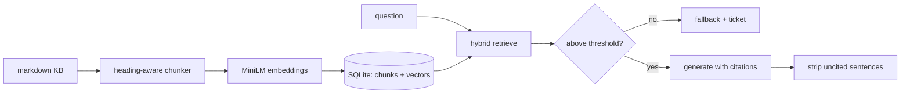

# rag-chatbot — a support chatbot that cites its sources or opens a ticket

[](https://github.com/darrshangovender/rag-chatbot/actions/workflows/tests.yml)
[](LICENSE)
[](https://python.org)
[](https://fastapi.tiangolo.com)

> Retrieval-augmented support Q&A over a markdown knowledge base. Heading-aware chunking, local MiniLM embeddings, hybrid dense + BM25 retrieval, and a generation path that strips any sentence without a citation before the answer leaves the process. Runs end to end on a laptop with no API key.

## Scope

This is a **public reference implementation**. The production version at the Agulhas Code client (under NDA) runs against their live help-centre corpus and ticketing system. The reference implementation here reproduces the same architecture — the same chunker, the same hybrid scorer, the same citation guard — over a synthetic knowledge base anyone can re-run. Deployment impact numbers from that engagement are not published.

**Why this exists.** The failure mode that kills a production support bot is not being wrong — it's being *confidently* wrong in a way the user can't check. So this design makes the citation the load-bearing element: the model is instructed to attach a chunk marker to every claim, and a post-processor deletes anything unmarked. What the user sees is either grounded and linkable, or an honest handoff to a human.

---

## Quick start

```bash
make install            # venv + pip install -e ".[dev]"
make seed               # index demo/sample_kb into SQLite
make run                # uvicorn on :8000
```

```bash
curl -s localhost:8000/ask -H 'content-type: application/json' \
     -d '{"question": "How do I reset my API key?", "k": 5}'
```

Or drive the pieces directly:

```python
from api.ingest.loader import load_markdown_dir
from api.ingest.chunker import chunk_documents
from api.ingest.embedder import embed_texts
from api.store.sqlite_store import SqliteStore
from api.retrieve.hybrid import HybridRetriever
from api.generate.fallback import check_confidence

docs   = list(load_markdown_dir("./demo/sample_kb"))
chunks = chunk_documents(docs, max_tokens=350, overlap_tokens=60)
vectors = embed_texts([c.text for c in chunks], batch_size=32, normalize=True)

store = SqliteStore("./data/index.sqlite")
store.reset()
store.insert_chunks(chunks, vectors)

passages = HybridRetriever(store, alpha=0.6).search("How do I reset my API key?", k=5)
print(check_confidence(passages).triggered)
```

## How it works



1. **Load** every `*.md` under the source tree into `Document(source_path, title, text, last_modified)`.
2. **Chunk** on the markdown heading tree, carrying a breadcrumb section path; oversized sections split on blank lines with a 60-token overlap.
3. **Embed** with `all-MiniLM-L6-v2` locally — 384 dimensions, L2-normalised, no API call.
4. **Store** chunks and float32 vectors in SQLite.
5. **Retrieve** by blending cosine and BM25: `alpha * ((cos+1)/2) + (1-alpha) * minmax(bm25)`, alpha 0.6.
6. **Gate** on the top score. Below threshold, return a canned "I'm not confident" reply and append a ticket row.
7. **Generate** an answer whose every claim carries a `[n]` marker, then **strip** any sentence that doesn't have one and map the surviving markers back to source paths.

## The pipeline stages

| Module | Role |
|---|---|
| `ingest/loader.py` | Recursive `*.md` walk; title from the first H1, else the filename |
| `ingest/chunker.py` | markdown-it heading walk → breadcrumb sections, overlap-aware splitting |
| `ingest/embedder.py` | `all-MiniLM-L6-v2`, 384-d, lazy-loaded and cached — local, free, offline |
| `store/sqlite_store.py` | `chunks` + `embeddings` (float32 BLOB) + `meta`; `load_all()` returns a numpy matrix |
| `retrieve/hybrid.py` | Dense cosine blended with min-max-normalised BM25 |
| `generate/citation_guard.py` | Citation contract in the system prompt + sentence-level uncited-claim stripper |
| `generate/fallback.py` | Confidence threshold; on trip, canned reply plus a JSONL ticket |

## Design decisions

| Decision | Why |
|---|---|
| **Local MiniLM rather than a hosted embedding API** | The whole repo runs offline with no key and no bill. Embedding quality is not the interesting part of this design; the guard is. |
| **Hybrid over pure dense** | Dense retrieval loses on rare literal strings — error codes, model numbers, CLI flags — which is most of what support questions contain. BM25 covers them; dense covers paraphrase. |
| **SQLite, not a vector database** | One file, no service to run, no migration to review. At this corpus size a numpy dot product over the whole matrix is faster than a network hop to a vector store. |
| **Strip uncited sentences rather than reject the whole answer** | Rejecting outright throws away good content over one stray sentence. Deleting the unsupported span keeps the answer useful and the failure quiet in the right direction. |
| **Ticket on low confidence, not a guess** | A bot that says "I don't know, here's a ticket" is a working product. A bot that guesses is a liability with a chat interface. |

## Limitations

- **The confidence fallback is effectively unreachable.** BM25 is min-max normalised *per query*, so the top hit always scores 1.0 on the keyword half, and cosine is remapped to `(cos+1)/2`, so an orthogonal chunk still scores 0.5. The floor for the top result is roughly `0.6*0.5 + 0.4*1.0 = 0.7`, well above the 0.45 threshold. On any non-empty index the ticket path never fires. This is the most important thing to fix in the repo, and the citation stripper is currently doing all the real work.
- **Default generation is extractive, not an LLM.** `LLM_PROVIDER` defaults to `extractive`, which concatenates the first two sentences of each top passage. Out of the box you get stitched snippets. Set the provider to `anthropic` with a key for actual generation.
- **A citation is checked for presence, not for support.** The guard verifies that a `[n]` marker exists and is in range. It does not verify that chunk *n* actually contains the claim. A model that cites confidently and wrongly passes.
- **The sentence splitter is fragile.** It splits on `[.!?]` followed by whitespace and an uppercase letter or quote. Sentences starting with a lowercase word, a digit, or a bullet never split — so one uncited clause can drag a whole block through, or one uncited fragment can delete a whole block.
- **Every query is a full linear scan in process memory**, and the retriever is built once at app startup. There is no ANN index and no reindex endpoint: re-ingesting requires a process restart.
- **Markdown only.** The loader globs `*.md`. There is no PDF, HTML, or Notion path.
- **No auth, no rate limiting, no tenancy.** `POST /ask` validates question length and `k` and nothing else. Anything that can reach the port can read the entire knowledge base and force an embedding compute per request.
- **Ticket writes are unlocked appends** to a JSONL file. Under multiple uvicorn workers the lines interleave.
- **Token budgeting is a whitespace-split approximation** (self-documented as within ~30%), so `max_tokens=350` chunks can overflow the encoder window on code-heavy or CJK content.

## Project layout

```
rag-chatbot/
├── api/
│   ├── main.py           # FastAPI: /health, /ask
│   ├── ingest/           # loader · chunker · embedder · CLI
│   ├── retrieve/         # hybrid dense + BM25 scorer
│   ├── generate/         # citation guard · confidence fallback
│   └── store/            # SQLite chunk + vector store
├── demo/sample_kb/       # 23 synthetic knowledge-base documents
└── Makefile              # install · seed · run · test · fmt
```

## Tests

```bash
make test        # python -m pytest
```

**There is currently no test suite** — `tests/` exists but is empty, and the CI workflow guards for that. For a repo whose entire thesis is a safety guard, that is the gap that matters most: the citation stripper and the confidence threshold both need characterisation tests before anyone should trust either.

## Author

Darrshan Govender · [Agulhas Code](https://agulhascode.co.za) · Durban, South Africa
